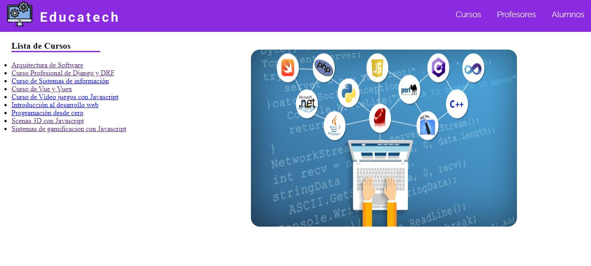
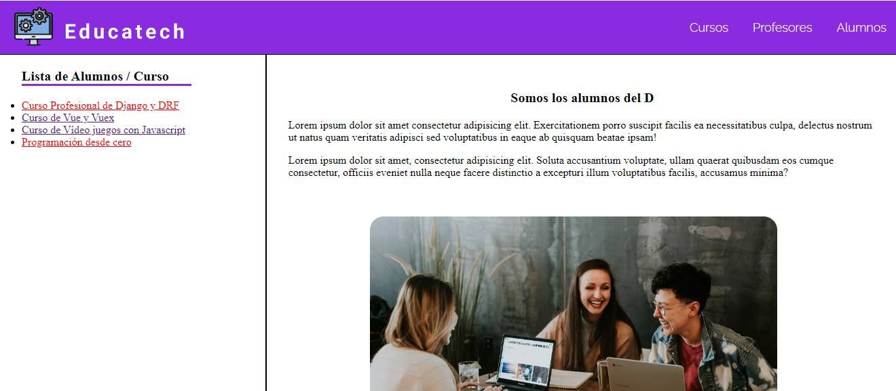

# WEBSITE EDUCATECH :school:

Let's build website EDUCATECH where we will consume a REST API created by Neunapp :v: .

## STACK TECH:

* Vue 3 
* Vue Cli
* Axios
* Api rest Neunapp
* Sass

## Screenshot






## Project setup
```
npm install
```

### Compiles and hot-reloads for development
```
npm run serve
```

### Compiles and minifies for production
```
npm run build
```

### Customize configuration
See [Configuration Reference](https://cli.vuejs.org/config/).
